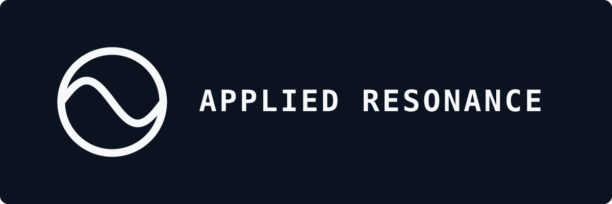
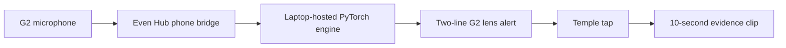

<p align="center">
  
</p>

<p align="center">
  <strong>Wearable acoustic anomaly detection for Even Realities G2 smart glasses.</strong>
</p>

<p align="center">
  <a href="https://www.connork.com/applied-resonance"><strong>Watch the 89-second hardware demo</strong></a>
  ·
  <a href="engine/REPORT_FULL.md">Full benchmark report</a>
  ·
  <a href="apps/evenhub/README.md">G2 app details</a>
</p>

## What it does

Applied Resonance learns how a healthy machine sounds, watches for persistent
acoustic changes, and sends a short warning to the wearer's glasses. A temple
tap preserves the previous 10 seconds of captured audio as evidence.

The current prototype connects four real components:



The glasses are a thin client. Audio capture and the HUD run through the G2 and
phone, while baseline modeling and anomaly scoring currently run on the laptop.

## Demonstrated loop

1. Capture 30 seconds of a healthy pump as the baseline.
2. Enter `LISTENING` while the machine remains normal.
3. Require a persistent acoustic change before showing `SUSPECT` or `ALERT`.
4. Display the warning and evidence line on the physical G2 lens.
5. Save the rolling 10-second evidence buffer with one temple tap.
6. Return to `LISTENING` when normal sound comes back.

The complete loop was run on physical Even Realities G2 glasses and is shown in
the [public demo](https://www.connork.com/applied-resonance).

## Benchmark evidence

The anomaly detector was evaluated on a documented split of **9,755 MIMII fan
and pump recordings** used in DCASE 2020. DCASE Task 2 is a research benchmark
for detecting unusual machine sounds when models are trained only on normal
examples.

| Machine | Applied Resonance kNN AUC | Published DCASE 2020 reference |
| --- | ---: | ---: |
| Fan | **0.693** | 0.658 |
| Pump | **0.880** | 0.729 |

The full run used PANNs CNN14 embeddings with per-machine-id kNN scoring and
passed a deterministic double-run check. See
[`engine/REPORT_FULL.md`](engine/REPORT_FULL.md) for every machine ID, AUC,
pAUC, split count, and the documented negative classifier result.

## Why the failed classifier stays documented

A separate fan-versus-pump classifier reached nearly perfect training accuracy
but only **0.577 validation accuracy** on machines it had never heard before.
It had learned machine-specific signatures instead of a general machine type.
That classifier was removed from the live runtime rather than hidden or
presented as a success.

## System design

- **Embedding:** PANNs `Cnn14_16k`, producing 2,048-dimensional audio features
- **Anomaly score:** per-machine-id kNN distance against normal-only training clips
- **Streaming:** 3-second windows, 1-second hop, EMA smoothing, calibrated percentile
- **Policy:** `LISTENING → SUSPECT → ALERT` with persistence and recovery hysteresis
- **Evidence:** deviating mel bands, envelope-spectrum clues, and a rolling audio buffer
- **Service:** FastAPI engine with bounded sessions, payloads, captures, and timeouts
- **Wearable:** Even Hub app with G2 microphone capture, lens rendering, and tap events

## Run locally

The Python project is managed with [`uv`](https://docs.astral.sh/uv/) and pinned
to Python 3.12.

```bash
uv sync
uv run python -m engine.smoke
```

Run the scoring service:

```bash
EARSIGHT_DEVICE=cpu uv run python -m engine.serve
```

The `EARSIGHT_*` environment prefix and `@earsight/display-card` package scope
are retained as legacy internal API names so the rebrand does not break existing
integrations.

Run the glasses-app tests:

```bash
cd shared/display-card && npm install && npm test
cd ../../apps/evenhub && npm install && npm test
```

Run the Python test suite:

```bash
uv run pytest
```

For detailed setup, the scoring-service API, the field recorder, and the re-record kit, see [docs/OPERATIONS.md](docs/OPERATIONS.md).

## Repository map

```text
applied-resonance/
├── engine/                 # embeddings, scoring, policy, evidence, FastAPI
├── apps/evenhub/           # physical G2 and phone companion application
├── shared/display-card/    # typed engine client and two-line HUD contract
├── desktop/                # Streamlit monitoring and labeling interface
├── killtest/               # playback, re-recording, noise, and rerun tools
├── datakit/                # mobile field-recording workflow
└── tests/                  # Python engine and evaluation tests
```

## Scope

This is a controlled-playback wearable prototype, not a field-validated
predictive-maintenance product. The reported percentile is an anomaly score,
not a probability of machine failure. The companion interface mirrors the HUD
state but is not an optical capture of the lens. Current inference is hosted on
the laptop, not fully on the glasses.

## Built by

[Connor Klann](https://www.connork.com) ·
[GitHub](https://github.com/cwklurks)
